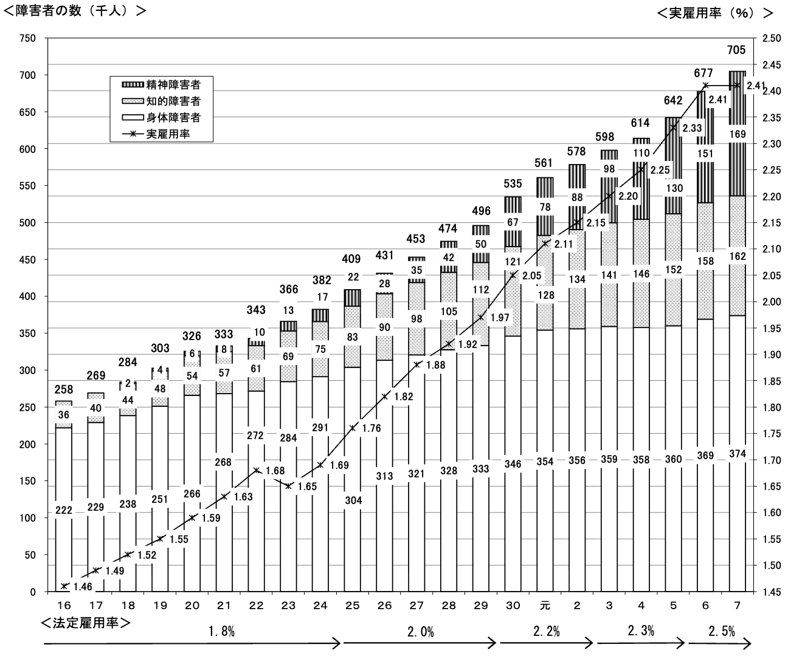
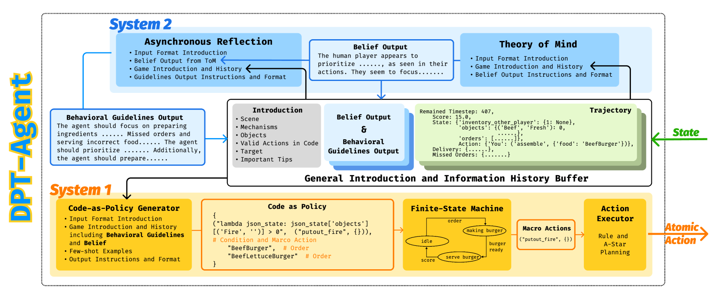

<!-- _paginate: skip -->
<!-- _class: title -->
<!-- _header: 2026-02-20 中間審査 -->

# ファジィ認知モデルとLLMによるリアルタイム協調エージェントとパーソナリティに基づく協調ペア設計

名古屋工業大学
工学専攻 博士後期課程
触覚学研究室
西村 匠生

---

<!-- _header: 研究背景 -->

## 障害者就労における「質」への要求

- 雇用障害者数は22年連続で過去最高を更新
  - 約70.5万人 (対前年比4.0%増)[1]
  - 法定雇用率も段階的に引き上げ[2]
- 政策課題は*量的拡大から質的向上へ*
  - 「能力発揮の促進」「成果の事業活動への活用」[3]
- 当事者の就業志向: 「_成長・活躍志向_」38.1%[4]
- アバターロボット OriHime による遠隔就労
  - 飲食店接客，オフィス受付などの就労を実現
  - _しかし，仕事内容は定型業務が中心_

<strong>個性を発揮・表現し， 社会貢献を実感する就労が求められている</strong>

[1] [厚生労働省, 令和7年 障害者雇用状況の集計結果, 2025.](https://www.mhlw.go.jp/content/11704000/001357856.pdf)
[2] [官報, 障害者の雇用の促進等に関する法律施行令等の一部を改正する政令（令和5年政令第44号）第1条・附則, 2023.](https://search.kanpoo.jp/r/20230301h927p3-a/)
[3] [今後の障害者雇用促進制度の在り方に関する研究会, 今後の障害者雇用促進制度の在り方に関する研究会報告書, 2026.](https://www.mhlw.go.jp/content/11704000/001650602.pdf)
[4] [パーソルダイバース, はたらく障害者の就業実態・意識調査 2025　vol.2 就業意識と合理的配慮](https://persol-diverse.co.jp/research/report013/)

<figure style='padding-top: 0.5rem; width: 75%' >

<figcaption>実雇用率と雇用障害者数の推移 (2025年)[1] </figcaption>
</figure>

<figure>

<figcaption>OriHime</figcaption>
</figure>
<!-- source: https://orihime.orylab.com/orihime/img/features/spec-01.png -->

<figure style="" >

<figcaption>分身ロボットカフェ DAWN ver.β</figcaption>
</figure>
<!-- source: https://dawn2021.orylab.com/assets/images/home/modal/gallery-1.jpg -->

---

<!-- _header: 研究背景 -->

## 創造的な遠隔協調就労: CoDeco

- 概要: 2人の操作者がGUIで1台のロボットを*共有操作*し，パンケーキをトッピングして提供する
- 共有操作に期待される利点:
  1. _タスク遂行能力の拡張_
     - 単独では達成困難な操作を双方向の介入で実現
  2. _心理的充足_
     - 共通目標に向けた対等・自発的な相互作用
     - 「関係性」「有能感」といった心理欲求に作用
- システムの特徴:
  - カーソル共有 → 暗黙的な操作意図の推定を補助
  - 対等な操作権 → 操作者の自律性を確保

<figure style="background: white; padding: 0.2rem;" >

<figcaption>システム概要</figcaption>
</figure>

<figure style="margin-top: 1em; background: white;" >

<figcaption>操作GUI</figcaption>
</figure>

---

<!-- _header: 研究背景 -->

## 実証実験と顕在化した課題

- 実カフェにおける短期(1日)・長期(9日間)の就労
  - 身体障害を有する計6名が参加
  - 流動的な協調により一定品質の商品提供を実現

- 顕在化した課題
  1. _コスト_: 2人の操作者が必要→人件費・設備費の増加
  2. _相性_: 個性の違いによる対立や作業遅延の可能性

### 着想: 片方の操作者をAIエージェントへ

- _操作者の心的充足に根ざした協調パートナー_
  - 有能感・自律感を損なわない協調
- エージェント同士のシミュレーションを通し，
  *望ましいペアの構築方法*を探索する

<figure style="width: 85%" >
<video src="shared/video/融合アバター共創実験_プロジェクトストーリー_JP.mp4" muted autoplay controls loop></video>
<figcaption>実証実験の様子</figcaption>
</figure>

<figure style="width: 85%; padding-top: 1em;" >

<figcaption>トッピング例</figcaption>
</figure>

---

<!-- _header: 先行研究の課題と研究目的 -->

### シェアードコントロール

- 機械が人間の作業を支援[1,2]
- 客観指標（効率・安全性）の
  最適化が主眼
- _人間の個性や心的状態に着目したシステムは少ない_

主観的体験を志向した 適応的協調が未実現

### LLM協調エージェント

- LLMの推論能力を活用[3,4]
  - ToM，計画，対話
- 計算コストが高く，
  _リアルタイム性能が低い_
- 行動出力の*解釈性が低い*

リアルタイム性・解釈性を 両立するアーキテクチャが未確立

### 協調ペアリング効果

- _性格構成が協調成果に影響_[5,6]
  - 討議・物理的な創造課題
- LLMエージェントを用いた検証[7]
  - 人間とLLMの広告作成で，
    性格構成が品質を向上[8]

リアルタイム協調における ペアリング効果が未解明

研究目的

1. 解釈可能な行動モデルのLLMエージェントによる，人間とのリアルタイム協調の実現
2. パーソナリティの組み合わせが協調操作に及ぼす影響解明と，エージェント設計論の構築

[1] [Abbink et al., A Topology of Shared Control Systems, IEEE T-HMS, 2018.](https://doi.org/10.1109/THMS.2018.2791570)
[2] [Losey et al., A Review of Intent Detection, Arbitration, and Communication ..., Appl. Mech. Rev., 2018.](https://doi.org/10.1115/1.4039145)
[3] [Guo et al., Embodied LLM Agents Learn to Cooperate in Organized Teams, 2024.](https://arxiv.org/abs/2403.12482)
[4] [Zhang et al., Building Cooperative Embodied Agents Modularly with LLMs, ICLR, 2024.](https://arxiv.org/abs/2307.02485)

[5] [Jolić Marjanović et al., The Big Five and Collaborative Problem Solving: A Systematic Review, 2024.](https://doi.org/10.1177/08902070231198650)
[6] [Curşeu et al., Personality characteristics that are valued in teams, Int. J. Psychol., 2019.](https://doi.org/10.1002/ijop.12511)
[7] [Ong et al., From LLM Personality to LLM Sociality, arXiv:2503.12722, 2025.](https://arxiv.org/abs/2503.12722)
[8] [Ju et al., Personality-Driven Adaptive AI, arXiv:2511.13979, 2025.](https://arxiv.org/abs/2511.13979)

---

<!-- _header: 目次 -->

1. エージェント要件
2. 人間とリアルタイム協調可能なLLMエージェント
   1. 関連研究と技術的課題
   2. 予備検証
   3. 提案手法
   4. 実験計画
3. パーソナリティ効果検証と協調エージェント設計
   1. 関連研究と目的
   2. 予備検証
   3. 提案手法
   4. 実験計画
4. まとめ

---

<!-- _header: エージェント要件 -->

### 設計制約

1. _リアルタイム応答性_
   - 人間の操作ペースに追従する 高速な行動生成
2. _意図推定と適応_
   - パートナーの意図・状況に応じた 協調戦略の変化

### 望ましい性質

3. _パーソナリティ表出_
   - 行動レベルで一貫した個性の形成
4. _解釈可能性_
   - 行動根拠が分析・説明可能な認知モデル

- _大規模言語モデル（LLM）_ の活用は，2・3に適している
  - 心の理論（ToM）による意図推定・長期計画，性格的概念に基づく推論
- 一方で，LLM単体では*推論が遅く*，_解釈性が低い_

---

<!-- _header: 人間とリアルタイム協調可能なLLMエージェント：関連研究と技術的課題 -->

## DPTに基づく，リアルタイム協調エージェント

- **Dual Process Theory** (DPT)
  - 人の認知を2つの処理系として捉える枠組み
    - System 2: 熟慮的・制御的・低速
    - System 1: 直感的・自動的・高速
  - 工学への応用
    - 制御における時間スケール分離[1]

- LLMエージェントへの応用:
  - _S2→LLM_（意図推定・計画・内省）
  - _S1→軽量モジュール_（即時応答）

  → **推論能力とリアルタイム性の両立**

- 代表例: DPT-Agent[2]
  - S2: ToM+非同期反省で相方意図を推定
  - S1: FSM（有限状態機械）で高速に行動
  - S2→S1: Code-as-PolicyでFSMを更新

<figure style="margin-top: 1em;" >

<figcaption>DPT-Agent Framework[2]</figcaption>
</figure>

[1] [Goel et al., 2017.](https://doi.org/10.1145/3152042.3152052)

[2] [Zhang et al., 2025.](https://arxiv.org/abs/2502.11882)

---

<!-- _header: 人間とリアルタイム協調可能なLLMエージェント：関連研究と技術的課題 -->

## 既存DPTアプローチのLLMエージェントの比較

|       アーキテクチャ       |          S2           |        S1 判断部         | S1 実行部  |     オンライン適応     |
| :------------------------: | :-------------------: | :----------------------: | :--------: | :--------------------: |
|  DPT-Agent[1]   | LLM (ToM/Reflection)  |   Code-as-Policy + FSM   | Procedural |   ○（S2→S1構造変更）   |
|     HLA[2]      |    LLM (Slow Mind)    |     SLM (Fast Mind)      | Procedural | △（S1=LLM in-context） |
|     DPMT[3]     | LLM (Multi-scale ToM) | SLM (token-prob scoring) | Procedural |           △            |
| AgileThinker[4] |    LLM (Planning)     |      LLM (Reactive)      |     —      |           △            |

### 技術的課題

- _判断が離散的_: FSM状態遷移では「少し危険」の様な曖昧な評価が困難
- _実行が固定的_: 事前定義ロジックでは協調行動の柔軟な調整や個性表現が困難

- _S1→S2の連携が希薄_: S1の判断困難が
  S2に伝達せず，必要に応じたS2の起動が困難
- _適応がLLMに依存_: 適応スピードがLLM推論に制限される

  

    

      
提案

      
→ System 1を<strong>ファジィ認知システム</strong>で構成する

    

  

---

<!-- _header: 人間とリアルタイム協調可能なLLMエージェント：関連研究と技術的課題 -->

## ファジィ認知モデル (FCM / FIS)

- 人間の*曖昧な認知（「少し危険」「かなり近い」）を連続値で定量化*する認知モデル群
- 知識を因果グラフや IF-THEN ルールとして表現 → **解釈可能**
- ルールは*言語変数*（「高い」「少し」）で構成され，**LLMの自然言語推論と親和性が高い**

### Fuzzy Cognitive Map (FCM)

- 概念ノード間の*因果関係を連続重み
  $w_{i,j}\in[-1,1]$で表現する*有向グラフ
  - 例: 「距離→危険度」に$-0.5$の因果
- Hebbian学習による*重みのオンライン更新*

### Fuzzy Inference System (FIS)

- 数値データをIF-THENルールで処理し，
  *連続的な出力*を生成
- _TSK型_: 後件部が定数または入力の一次式
  → _勾配ベースのパラメータ学習_ が可能

---

<!-- _header: 人間とリアルタイム協調可能なLLMエージェント：予備検証 -->

## FISエージェントによる協調タスク遂行の検証[1]

### 目的

- FuzzyDPT-Agentの前提として，以下の2点を確認する
  1. FISによる行動生成で協調タスクを遂行可能か
  2. LLMがFISの構造・パラメータを適切に変更可能か

### 実験設計

- GUI操作ボール運搬ゲーム（共有操作）
  - 2プレイヤーが同時に操作
  - ゲートは1.5秒間のみ開く → 協調が必須
- エージェント設計：
  - S1: FIS（Mamdani型）によるカーソル操作
  - S2: タスク外でのFIS変更

### 検証結果

- _FISでリアルタイムな協調操作を実現_
- _役割に応じたFISのルール編集を確認_
  - 例: 移動担当→移動ルールの重み↑
    Grip/Gateルールの重み↓

<figure style="margin-top: 0.5em;">
<video src="assets/video/jsai2025_agent_coop_play.mp4" muted autoplay controls loop style="width: 53%;"></video>
<figcaption>エージェント同士でのゲームプレイの様子</figcaption>
</figure>

[1] 西村ら, 個性を持った操作エージェント同士の協調による協調ポリシーの獲得, JSAI, 2025.

---

<!-- _header: 人間とリアルタイム協調可能なLLMエージェント：予備検証 -->

## FCM/FISとVLMによるDPTアーキテクチャの検討[1]

### 目的

- S1をFCM/FISで構成するDPTアーキテクチャで
  協調タスクを遂行可能か検証する
  1. S1(FCM/FIS) が連続・高速な行動出力が可能か
  2. S2(VLM) が視覚に基づき判断しS1を誘導可能か

### 実験設計

- 2Dゲーム（ボール運び）協調プレイ
- エージェント設計:
  - S1: FCM（マクロ行動選択）+ FIS（行動生成）
    - 事前定義，オンライン更新なし
  - S2: 軽量VLM（`gpt-4.1-nano`, 5Hz）
    - 画面画像からタスク方針を判断

### 検証結果

- S1: _連続的な行動生成（100Hz）を実現_
- S2: _軽量VLMでは高頻度の状況判断が困難_
  - 複雑なルールの考慮が不十分
  - 行動切り替わり時に遅延が発生

<figure style="margin-top: 0.4em;">
<video src="assets/video/rsj2025_agent_coop_play.mp4" muted autoplay controls loop style="width: 55%;"></video>
<figcaption>エージェント同士のゲームプレイの様子</figcaption>
</figure>

→ _非同期LLMによるS2が必要_

[1] 西村ら, LLMとファジィシステムによる言語推論を活用した階層的ロボットアーキテクチャ, RSJ, 2025.

---

<!-- _header: 人間とリアルタイム協調可能なLLMエージェント：提案手法 -->

## FuzzyDPT-Agent

- FCM/FISによる高速なSystem 1と，
  LLMによる熟慮的なSystem 2を統合

### 特徴

**連続的な知覚行動**

- FCM: 因果伝播による状況評価
- FIS: ルールベースの行動生成

**S1&harr;S2 連携**

- S1→S2: 不確実性指標に基づく
  適応的なS2起動
- S2→S1: LLMによる行動方針の誘導

**多層オンライン適応**

- L0: 報酬に基づく
  FCM/FISパラメータ更新
- L1: LLMによる構造変更

**解釈可能性**

- 判断根拠: FCM因果グラフ
- 行動根拠: FISのIF-THENルール

<figure style="margin-top: 1em;" >

<figcaption>FuzzyDPT-Agent 全体構成</figcaption>
</figure>

---

<!-- _header: 人間とリアルタイム協調可能なLLMエージェント：提案手法 -->

## FCM/FIS による連続的知覚行動モデル

###

### Subtask Selector FCM

- 役割: 判断（_何をするか_）
- 状態特徴量 $s_t$ を入力とし，
  *因果伝播*でサブタスク重み $w_t$ を算出
  - Input → Hidden → Output の3層因果グラフ
  - 前状態を減衰保持しながら時系列変化を統合

### Subtask FIS

- 役割: 制御（_どう実行するか_）
- FCM Outputノードと1対1対応したTSK-FIS群
  - 選択サブタスク $i^*$ の FIS のみが実行される
- 状態 $s_t$ を入力とし，ルール発火度の
  *重み付き平均*で行動パラメータ $\phi_{i^*}$ を生成

<figure style="width: 95%;">

<figcaption>System 1 パイプライン</figcaption>
</figure>

---

<!-- _header: 人間とリアルタイム協調可能なLLMエージェント：提案手法 -->

## S1 &harr; S2双方向連携

- 既存手法の周期的起動に対し，_S1の迷いに基づきS2を起動_
  → LLM推論コストを抑えつつ，必要なタイミングで適切に介入

### S1→S2： 不確実性指標によるトリガー

**FCM不確実性：サブタスク選択の迷い**

| 指標                     | 意味                            |
| :----------------------- | :------------------------------ |
| 正規化エントロピー $H_n$ | 全候補の重みが均等 → 選択が拡散 |
| マージン $M$             | 最上位と次点の差が小さい → 拮抗 |

**FIS不確実性：行動根拠の欠如**

| 指標                   | 意味                             |
| :--------------------- | :------------------------------- |
| 被覆度 $C(s)$          | マッチするルールがほぼない       |
| 実効ルール数 $N_{eff}$ | 有効に発火しているルールが少ない |

### S2→S1: LLMワーカーによる介入

| ワーカー | 出力                           | 介入先            |
| :------: | :----------------------------- | :---------------- |
|   ToM    | 推論特徴量                     | 特徴量キャッシュ  |
| Planner  | バイアス $(\tilde{b}, \alpha)$ | FCM Output ノード |

- **ToM**: 観測からの算出が困難なパートナー意図や心的状態を推論し特徴量として出力
- **Planner**: FCMのサブタスク選択の方針を重みで誘導（確信度$\alpha$で介入強度を制御）

---

<!-- _header: 人間とリアルタイム協調可能なLLMエージェント：提案手法 -->

## オンラインパラメータ適応（L0）

- 毎ステップ，報酬信号に基づきFCM/FISのパラメータをオンライン更新
- FCMとFISで*学習信号を分離*し，判断と実行の改善干渉を防止

<figure style="width: 75%; margin-top: 0.4em;">

<figcaption>L0 更新フロー</figcaption>
</figure>

### 学習信号の分離

- **RewardFIS**: 状態から内部報酬$r_t$を生成
- **選択アドバンテージ** → FCM
  - 良いサブタスクを選べたか → $W_{oh}$を更新
- **実行アドバンテージ** → FIS
  - うまく実行できたか → 後件部を更新
- *LLMに依存しない*即時的な適応

---

<!-- _header: 人間とリアルタイム協調可能なLLMエージェント：実験計画 -->

## FuzzyDPT-Agent の実装状況

### 実行基盤の構築

- _dora-rs_ によるリアルタイムデータフローを実装
  - 環境ステップ・エージェント推論・GUI表示
- ベースライン（DPT-Agent）の動作を確認済み

### FuzzyDPT-Agent の実装

- **全モジュールの実装は完了**
  - S1: 特徴量算出 → FCM → FIS → 行動出力
  - S2: ToM, Planner
  - L0 適応（Hebbian / 勾配更新）
  - 不確実性トリガー，Planner バイアス

<figure style="margin-top: -1.5em; width: 85%;">
<video src="assets/video/overcooked_burger_dpt.mp4" muted autoplay controls loop></video>
<figcaption>Burger環境でのDPT-Agent動作の様子</figcaption>
</figure>

### 検証における課題

- _LLM による FCM/FIS初期化_:
  生成は成功したが，**タスクが進捗しない**
  ルール→特徴量のトップダウン式を検討

---

<!-- _header: 人間とリアルタイム協調可能なLLMエージェント：実験計画 -->

## 実験1： アーキテクチャ性能評価（エージェント同士）

### 既存アーキテクチャとの比較実験

- 環境: Overcooked（DPT-Agent論文準拠）

| 実験     | 条件                                                                             | 主な検証内容                 |
| :------- | :------------------------------------------------------------------------------- | :--------------------------- |
| S1比較   | FCM vs FSM，FIS vs Procedural（S2なし）                                          | ファジィ認知モデルS1の有効性 |
| S2連携   | 不確実性トリガー  vs 周期トリガー                                             | コスト-性能トレードオフ      |
| 適応性能 | 非定常環境シチュエーションにおけるL0/L1 の有無 (2×2)                             | 適応速度と回復能力           |
| E2E比較  | FuzzyDPT / DPT-Agent / AgileThinker / ReAct                                   | 総合性能・コスト効率         |
| Ablation | FuzzyDPTから各要素を除去 (S2, ToM, Planner bias, 不確実性トリガー, L0, L1) | 各要素の寄与特定             |

### 予測される差異

| 検証内容 | 指標                           | 予測              | 根拠                                                |
| :------- | :----------------------------- | :---------------- | :-------------------------------------------------- |
| S1の効果 | 停滞時間， スコア効率       | FCM+FIS群で改善   | 連続判断で遷移遅延なし．FISで状況依存的な回避・譲り |
| S2連携   | _同一性能でのS2呼出し回数_     | 不確実性 < 周期   | 必要時のみ起動で 冗長な呼出しを削減              |
| 適応機構 | _非定常時の 回復ステップ数_ | L0+L1 < 各単独 | L0で即時パラメータ調整．L1で構造的対応              |

---

<!-- _header: 人間とリアルタイム協調可能なLLMエージェント：実験計画 -->

## 実験2: 人間との協調性能評価

### 実験設計

- **条件**: FuzzyDPT vs DPT-Agent（vs Rule-Based）
- **被験者数**: N≈20（被験者内比較）

### 評価指標

| カテゴリ       | 指標                                 |
| :------------- | :----------------------------------- |
| 客観・成果     | 累積スコア，完了数                   |
| 客観・プロセス | 干渉回数，スコア寄与率など           |
| 主観           | Human-Computer Trust Scale（信頼度） |
| 主観           | NASA-TLX（作業負荷）                 |
| 主観           | 選好ランク                           |

### 予測される差異

| 予測                         | 評価指標                             | 根拠                                                                             |
| :--------------------------- | :----------------------------------- | :------------------------------------------------------------------------------- |
| 協調動作の 滑らかさが向上 | 干渉回数，スコア寄与率               | FISの連続行動による滑らかな回避・譲り                                            |
| _信頼向上・ 作業負荷低減_ | HCTS（信頼度），NASA-TLX（作業負荷） | 滑らかな動作 →予測可能性↑ 調整負荷↓ |
| 総合的にFuzzyDPT優位         | 選好ランク                           | 停滞低減＋ 滑らかな譲りが 協調体験に寄与                                   |

---

<!-- _header: パーソナリティ効果検証と協調エージェント設計：関連研究と目的 -->

### パーソナリティ表出

- 既存手法はLLMレベルでの表出[1,2]
  - プロンプト，活性値操作，ファインチューニング
- _行動レベルでの一貫性が未検証_
  - LLM出力とロボット行動の対応が間接的

知覚行動モデルへの パーソナリティ反映が未実現

### 協調におけるパーソナリティの影響

- _性格構成が協調に影響_[3,4]
  - 囚人のジレンマ，広告作成
- 既存研究の限界:
  - _非同期な順次交代タスク_[4]

共有制御リアルタイム協調での パーソナリティの影響は未検証

研究目的

1. *知覚行動モデル（FCM/FIS）の構造・パラメータ*として
   パーソナリティを表出する手法の実現と妥当性検証
2. パーソナリティの組み合わせが*リアルタイム共有制御協調*
   に及ぼす影響の解明と，エージェント設計指針の導出

[1] [Jiang et al., Evaluating and Inducing Personality in Pre-trained LMs, NeurIPS, 2023.](https://arxiv.org/abs/2206.07550)
[2] [Panickssery et al., Steering Llama 2 via Contrastive Activation Addition, 2023.](https://arxiv.org/abs/2312.06681)

[3] [Ong et al., From LLM Personality to LLM Sociality, arXiv:2503.12722, 2025.](https://arxiv.org/abs/2503.12722)
[4] [Ju et al., Personality-Driven Adaptive AI, arXiv:2511.13979, 2025.](https://arxiv.org/abs/2511.13979)

---

<!-- _header: パーソナリティ効果検証と協調エージェント設計：予備検証 -->

## パーソナリティに基づく協調行動の形成可能性

### LLMによるパーソナリティに基づいたFIS構造変更[1]

- Big5パラメータ（外向性・協調性等）を設定したエージェントのFISをLLMで変更
- 結果: LLMがパーソナリティに応じて*FISルールを修正*
  - 例: E,A=高 →「何もしない」ルールを削除

### 軽量VLMによるパーソナリティ反映の検証[2]

- 高頻度（5Hz）で状況判断するVLM（S2）に性格特性を指示
- 結果: _性格特性を考慮した推論が確認できなかった_

### 得られた知見

- LLMによるFIS構造変更でパーソナリティ反映は**可能**
- 高頻度VLMでは性格反映が困難 → *非同期S2*での実現が必要

[1] 西村ら, 個性を持った操作エージェント同士の協調による協調ポリシーの獲得, JSAI, 2025.
[2] 西村ら, LLMとファジィシステムによる言語推論を活用した階層的ロボットアーキテクチャ, RSJ, 2025.

---

<!-- _header: パーソナリティ効果検証と協調エージェント設計：提案手法 -->

## パーソナリティ表出と多層適応（L1 / L2）

### パーソナリティ表出の設計思想

- LLMにより目指す行動モデルを推論し，
  知覚行動モデル（FCM/FIS）を
  目標パーソナリティに適合していく
- **モデル変更提案と整合性検証を分離**
  - パーソナリティに反した変更を棄却し，
    反映を構造的に担保

→ 知覚行動モデル（FCM/FIS構造）に*直接反映*

### L1: 構造パッチ（非同期イベント駆動）

- FCM/FISの**構造変更のJSONパッチ**を提案
  - 変更対象: FCM構造，FISルール
  - クエリツールを活用し，必要な情報を収集
  - 実装状況：_適正なパッチ出力を確認した_

### L2: 多目的進化（エピソード間）

- FCM/FIS構造を多目的最適化
  - 目的: タスク性能 × _パーソナリティ整合性_
  - _LLMが目的設計・交叉・変異を担う_

---

<!-- _header: パーソナリティ効果検証と協調エージェント設計：実験計画 -->

## 実験計画

### 実験4: Agent×Agent ペアリング効果

- 問い: _パーソナリティの組み合わせは 協調成果にどう影響するか_
- パーソナリティを設定したエージェント同士で協調タスクシミュレーション
- 主効果と*ペアリング効果（交互作用）* を検証
- タスク履歴に加え*FCM/FIS構造から効果を分析*

| カテゴリ | 指標                               |
| :------- | :--------------------------------- |
| 成果     | 累積スコア，完了数，効率           |
| プロセス | 役割分担比率，干渉頻度，行動同期率 |
| 内部状態 | S2起動頻度，不確実性推移，適応頻度 |

### 実験5: Human×Agent 転移検証

- 問い: _Simで得られたペアリング効果は 人間との協調でも再現されるか_
- 被験者の性格特性をBig5質問紙で調査
- 実験4の効果量に基づき，被験者にとって
  好/悪相性と予測されるペア構成を割り当て

| カテゴリ | 指標                           |
| :------- | :----------------------------- |
| 客観     | スコア，干渉回数，役割分担比率 |
| 主観     | HCTS（信頼），NASA-TLX（負荷） |
| 転移     | Sim&harr;Human 効果量の相関    |

- 効果量に正相関
  → _Sim事前探索による望ましいペア推定が有効_

---

<!-- _header: まとめ -->

## まとめ

### 研究目的

1. *解釈可能な行動モデル*のLLMエージェントによる，*人間とのリアルタイム協調*の実現
2. *パーソナリティの組み合わせが協調操作に及ぼす影響*解明と，エージェント設計論の構築

### 提案手法: FuzzyDPT-Agent

- **S1（FCM/FIS）**: 高速・連続的な判断・行動
- **S1&harr;S2連携**: 不確実性に基づくS2の適応的起動
- **L0適応**: S1パラメータのオンライン更新
- **L1適応**: LLMによる構造パッチ
- **L2適応**: LLMベース多目的進化

### 今後の計画

1. Overcookedを完走するFCM/FISを構築 → 実験1（アーキテクチャ性能評価）
2. L2適応の実装・検証
   パーソナリティ整合性検証 → 実験2・実験4
3. 実験5（Human×Agent転移検証），
   エージェント設計指針の考察

---

<!-- _hide: true -->
<!-- _header: 提案手法 -->

## 観測から状態表現 $s_t$ への変換（Perceiver）

- 観測 $o_t$ を処理し，FCM/FIS が参照する状態 $s_t \in \mathbb{R}^n$ を生成

| カテゴリ       | 定義                | mode  | 計算             |
| :------------- | :------------------ | :---: | :--------------- |
| **Primitive**  | 観測から直接取得    | sync  | SQL              |
| **Relational** | Primitive から算出  | sync  | SQL + UDF        |
| **Inferred**   | S2 (ToM) の推論結果 | async | LLM → キャッシュ |

- **Sync**: 毎ステップ SQL で高速算出
  - 履歴参照（速度，移動平均等）も SQL で表現
- **Async**: S2 (ToM) 推論結果をキャッシュに格納し，
  時間経過で中立値へ*指数減衰*
  $$v_t = v_{neu} + (v_{cache} - v_{neu}) \cdot 2^{-\Delta t/\tau}$$
  - S1 のリアルタイム性を損なわず，
    パートナー意図の推論を反映

<figure style="width: 90%; margin-top: 0em;">

</figure>

