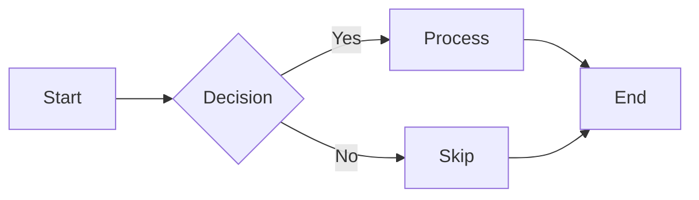
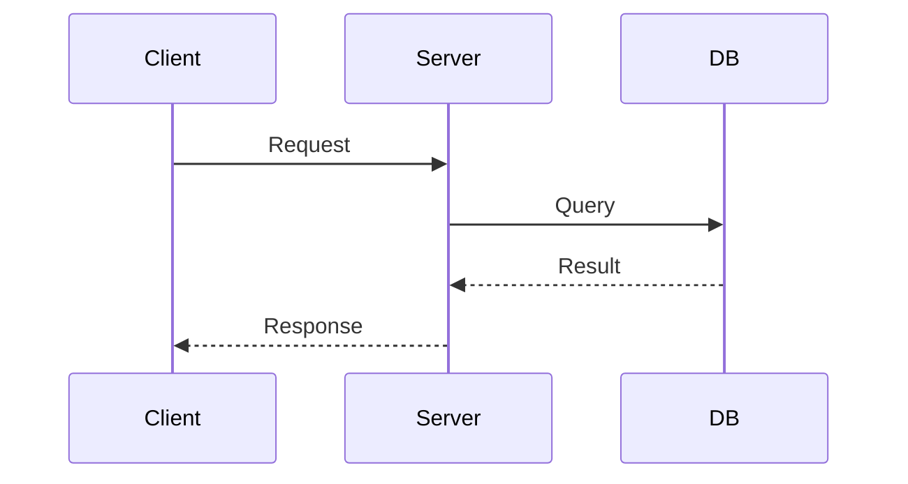
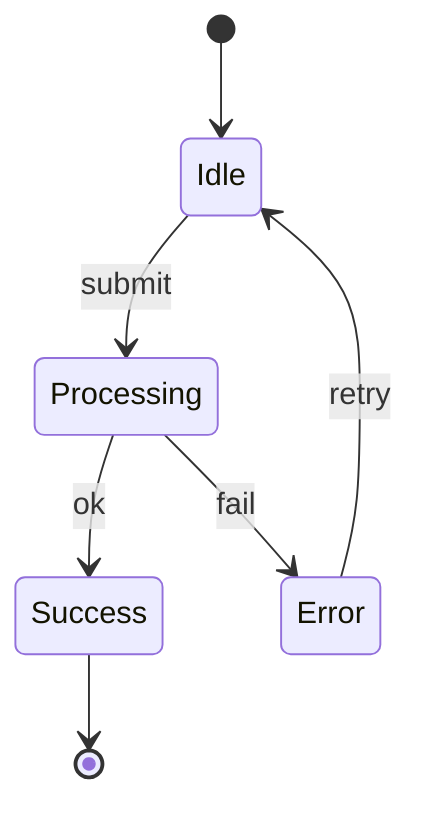
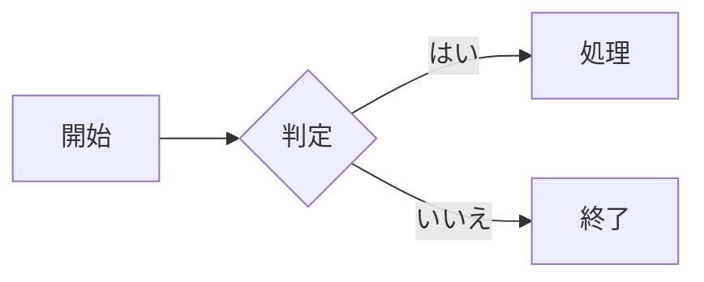
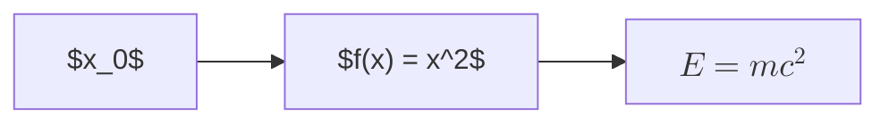

<!-- _paginate: skip -->
<!-- _class: title -->
<!-- _header: 2026-01-01 -->

# Marp Slide Guide

<div class="info">

Lab Slide Template

</div>

---

<!-- _header: Slide Classes -->

## Basic Classes

- `.title` - Title slide with centered heading
- `.invert` - Dark mode (inverts colors)
- `.col` - Two-column layout
- `.fit` - Fit content to slide

```markdown
<!-- _class: title -->       # Title slide
<!-- _class: invert -->      # Dark mode
<!-- _class: title invert --> # Title slide with dark mode
```

---

<!-- _header: Text Emphasis -->

## Emphasis Styles

- _Italic with underline_ - `*text*` or `_text_`
- **Bold with color** - `**text**` or `__text__`
- ==Highlighted text== - `==text==`

### Usage

```markdown
This is _emphasized_ text with underline.
This is **strong** text with yellow color.
This is ==marked== text with background.
```

---

<!-- _header: Lists -->

## Unordered List

- Item 1
  - Nested item 1.1
  - Nested item 1.2
- Item 2
- Item 3

---

<!-- _header: Lists -->

## Ordered List

1. First item
   1. Nested 1.1
   2. Nested 1.2
2. Second item
3. Third item

---

<!-- _header: Text Sizes -->

## Display Size Classes

- `text-xl5` - 3em
- `text-xl4` - 2.25em
- `text-xl3` - 1.875em
- `text-xl2` - 1.5em
- `text-xl` - 1.25em

---

<!-- _header: Text Sizes -->

## Body Size Classes

- `text-lg` - 1.125em
- `default` - 1em
- `text-sm` - 0.875em

Split content before reducing type.

---

<!-- _header: Colors -->

## Neutral and Warm Colors

<span class="white bg-gray-800 px-2">white</span>
<span class="black">black</span>
<span class="gray">gray</span>
<span class="red">red</span>
<span class="orange">orange</span>
<span class="yellow">yellow</span>

---

<!-- _header: Colors -->

## Cool and Accent Colors

<span class="green">green</span>
<span class="cyan">cyan</span>
<span class="blue">blue</span>
<span class="purple">purple</span>
<span class="pink">pink</span>

### Usage

```markdown
<span class="red">Red text</span>
<span class="blue">Blue text</span>
```

---

<!-- _header: Two-Column Layout -->

## Column Layout

<div class="col">
<div>

### Left Column

Content for the left side.

- Point 1
- Point 2

</div>
<div>

### Right Column

Content for the right side.

1. Step 1
2. Step 2

</div>
</div>

```html
<div class="col">
  <div>Left content</div>
  <div>Right content</div>
</div>
```

---

<!-- _header: Callout Boxes -->

## Informational Callouts

<div class="note">

**Note**: General information or tips.

</div>

<div class="tip">

**Tip**: Helpful suggestions.

</div>

---

<!-- _header: Callout Boxes -->

## Cautionary Callouts

<div class="warning">

**Warning**: Important caution.

</div>

<div class="caution">

**Caution**: Potential issues.

</div>

<div class="important">

**Important**: Critical information.

</div>

---

<!-- _header: Figures -->

## Figure Width Classes

<div class="col">
<div>

```html
<figure class="w-full">
  
  <figcaption>Full width</figcaption>
</figure>
```

Available classes:

Use `.w-full`, `.w-3/4`, `.w-1/2`, `.w-1/3`, or `.w-1/4`.

</div>
<div>

<figure class="w-3/4">

<figcaption>w-3/4 example</figcaption>
</figure>

</div>
</div>

---

<!-- _header: Info Block -->

## Info Block for Title Slides

Use `.info` class for author/affiliation info:

```html
<div class="info">Affiliation: Department Name: Author Name</div>
```

This creates right-aligned text suitable for title slides.

---

<!-- _header: Color Schemes -->

## Dark Color Schemes

- `.neogaia` - Dark default
- `.dracula` - Purple accent
- `.one-dark` - Blue accent
- `.nord` - Cyan accent

Dark themes automatically switch to inverted logos.

---

<!-- _header: Color Schemes -->

## Light Color Schemes

- `.neogaia.invert` - Light variant
- `.github-light` - Light canvas

---

<!-- _class: dracula -->
<!-- _header: Dracula Theme -->

## Dracula Color Scheme

This slide uses the **Dracula** color scheme.

- Dark purple background
- Light text
- Purple accent color

```markdown
<!-- _class: dracula -->
```

---

<!-- _class: one-dark -->
<!-- _header: One Dark Theme -->

## One Dark Color Scheme

This slide uses the **One Dark** color scheme.

- Dark gray background
- Muted text colors
- Blue accent color

```markdown
<!-- _class: one-dark -->
```

---

<!-- _class: nord -->
<!-- _header: Nord Theme -->

## Nord Color Scheme

This slide uses the **Nord** color scheme.

- Arctic blue background
- Light text
- Cyan accent color

```markdown
<!-- _class: nord -->
```

---

<!-- _class: github-light -->
<!-- _header: GitHub Light Theme -->

## GitHub Light Color Scheme

This slide uses the **GitHub Light** color scheme.

- White background
- Dark text
- Blue accent color

```markdown
<!-- _class: github-light -->
```

---

<!-- _class: neogaia -->
<!-- _header: Neogaia Theme (Dark) -->

## Neogaia Color Scheme

This slide uses the **Neogaia** color scheme (dark mode by default).

- Dark blue-gray background
- Warm white text
- _Yellow emphasis_ and **strong text**

```markdown
<!-- _class: neogaia -->
```

---

<!-- _class: neogaia invert -->
<!-- _header: Neogaia Theme (Light) -->

## Neogaia Light Mode

This slide uses the **Neogaia** color scheme with `.invert` (light mode).

- Warm white background
- Dark text
- _Darker emphasis_ for visibility

```markdown
<!-- _class: neogaia invert -->
```

---

<!-- _header: Mermaid Diagrams -->

## Flowchart



---

<!-- _header: Mermaid Diagrams -->

## Sequence Diagram



---

<!-- _header: Mermaid Diagrams -->

## State Diagram



---

<!-- _header: Mermaid Diagrams -->

## CJK & Math in Diagrams

<div class="col">
<div style="width: 500px;">



</div>
<div>



</div>
</div>

---

<!-- _paginate: skip -->
<!-- _class: title invert -->
<!-- _header: 2026-02-02 -->

# Thank You

<div class="info">

Questions?

</div>
