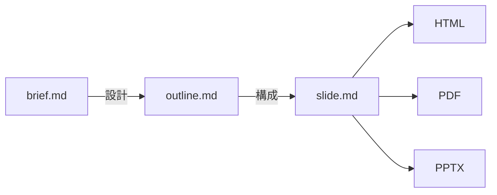
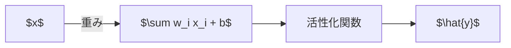
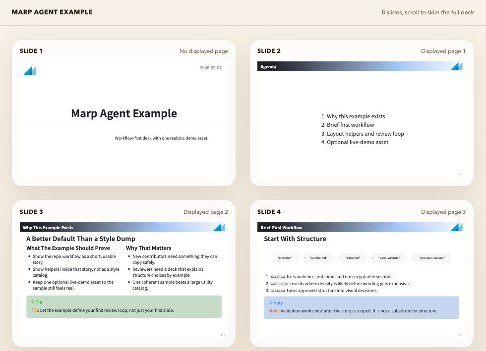
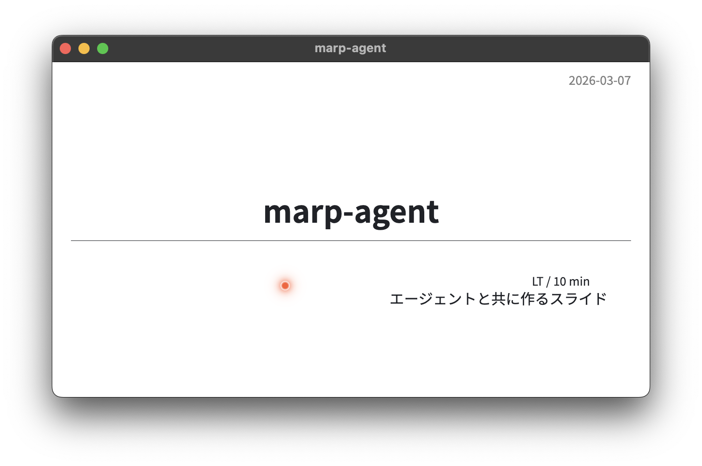

<!-- _paginate: skip -->
<!-- _class: title -->
<!-- _header: 2026-03-07 -->

# marp-agent

<div class="info">

Marp + AI で作る構造化スライド制作

</div>

---

<!-- _header: marp-agent -->

## Marp とは? & その課題

<div class="col">
<div>

**Marp の良いところ**

- Markdown でスライドを書ける
- `---` でページを区切るだけ
- HTML/PDF/PPTX に出力可能
- VS Code 拡張や CLI で使える OSS

</div>
<div>

**よくある課題**

- 自由すぎて**構造が崩れやすい**
- テキスト詰め込みで**読めないスライド**に
- テーマのカスタマイズが**CSS 直書き**
- レビューの基準が**属人的**

</div>
</div>

<div class="important">

Markdown の手軽さを活かしつつ, 品質を担保したい

</div>

---

<!-- _header: marp-agent -->

## marp-agent のアプローチ

**構造化ワークフロー** + **自動バリデーション** + **カスタムテーマ**

<div style="width: 90%">



</div>

brief → outline → slide の **3 段階**で, 設計から成果物まで一気通貫

---

<!-- _header: Workflow -->

## Step 1: デッキの作成

```bash
npm run new decks/my-talk
```

生成されるファイル構成:

```
decks/my-talk/
├── brief.md        # プレゼンの設計書
├── slide.md        # スライド本体
├── assets/img/     # 画像置き場
├── assets/video/   # 動画置き場
└── shared -> ../../assets  # 共有アセット
```

<div class="tip">

ロゴやフォントなど共有アセットは `shared/` シンボリックリンクで参照

</div>

---

<!-- _header: Workflow -->

## Step 2: brief.md を書く

<div class="col">
<div>

```markdown
## Audience

- Primary audience: 研究室の学生
- Existing knowledge: Markdown の基本

## Duration

- Total talk length: 10 min
- Target slide count: 12

## Core Message

- One-sentence takeaway:
  marp-agent で効率的にスライドを作れる
```

</div>
<div>

**brief.md の 8 項目**

1. Audience (聴衆)
2. Duration (時間)
3. Core Message (主張)
4. Audience Action (行動)
5. Required Sections (必須章)
6. Must-Use Assets (必須素材)
7. Forbidden Patterns (禁止事項)
8. References (参考文献)

</div>
</div>

---

<!-- _header: Workflow -->

## Step 3: アウトライン生成

```bash
npm run outline -- decks/my-talk/brief.md
```

brief.md をパースし, 自動で `outline.md` を生成:

| 生成されるスライド | 内容                            |
| :----------------- | :------------------------------ |
| Opening promise    | 聴衆の関心を引く冒頭            |
| Agenda             | セクション一覧 (3 つ以上の場合) |
| Required Sections  | brief で定義した各章            |
| Close              | まとめ & CTA                    |

各スライドに **Title / Takeaway / Layout hint / Overflow risk** を付与

---

<!-- _header: Workflow -->

## Step 4: スライド執筆 & バリデーション

<div class="col">
<div>

```bash
# バリデーション
npm run deck:validate \
  -- decks/my-talk/slide.md

# レポート付き
npm run deck:validate \
  -- decks/my-talk/slide.md \
  --report-dir out/my-talk
```

</div>
<div>

**レポートの出力内容**

- `report.md` - 人間が読めるレポート
- `report.json` - 機械処理用データ
- `screenshots/` - 全スライドの PNG

スライド単位で問題箇所を特定できる

</div>
</div>

<div class="tip">

AI エージェントとの組み合わせ: バリデータの結果を元に自動でスライドを修正するワークフローも構築可能

</div>

---

<!-- _header: Validator -->

## バリデータの検査ルール

| ルール                  | 検出内容               | 閾値例            |
| :---------------------- | :--------------------- | :---------------- |
| `long-heading`          | 見出しが長すぎる       | 48 文字超         |
| `dense-bullets`         | 箇条書きが多すぎる     | 7 個以上          |
| `figure-text-density`   | 画像+テキストの過密    | 画像横に 4 行以上 |
| `comparison-overpacked` | 比較スライドの詰め込み | 5 列 3 行以上     |
| `typography-drift`      | 極小フォントの使用     | text-xs 系の検出  |
| `overflow-risk`         | 総合的なはみ出し危険度 | 360 文字超        |

<div class="warning" style="margin-top: -1em;">

"Split dense material instead of shrinking text" が基本方針

</div>

---

<!-- _header: Validator -->

## バリデータが防ぐもの

<div class="col">
<div>

**Before (検出される例)**

- 箇条書き 10 個以上
- 画像の横にテキスト密集
- `text-xs` で無理やり詰め込み
- 見出しが 2 行にまたがる

</div>
<div>

**After (修正後)**

- 1 スライド 1 メッセージ
- 図とテキストを分離
- 適切なフォントサイズ
- 簡潔な見出し

</div>
</div>

<div class="important">

バリデータは**ガードレール**: 詰め込みを検出し, スライド分割を促す

</div>

---

<!-- _header: Theme -->

## lab テーマの特徴

<div class="col" style="gap: 0.5rem;">
<div style="flex: 1.3;">

**Tailwind CSS v4 ベース**

- **レイアウト**: `.col`, `.center-body-stack`, `.fit`
- **タイポグラフィ**: `.text-xs3` ~ `.text-xl5`
- **レーザーポインター**: プレゼン時にカーソルが光る

**5 種のカラースキーム**

- Dracula
- One Dark Pro
- Nord
- Neogaia
- GitHub Light

</div>
<div>

**5 種のコールアウト**

<div class="note">

`.note` - 情報の補足

</div>

<div class="tip">

`.tip` - 便利な Tips

</div>

<div class="warning">

`.warning` / `.caution` - 注意・警告

</div>

</div>
</div>

---

<!-- _header: Theme -->

## Mermaid 図の日本語対応

標準の mermaid.js は foreignObject 内でフォント幅を誤検出し, **日本語ラベルがはみ出す**問題がある. marp-agent は **beautiful-mermaid** で DOM-free SVG レンダリングを行い, これを解決



<div class="tip">

Mermaid ノード内で MathJax 数式 (`$...$`) も使用可能. 日本語ラベルとの共存も OK

</div>

---

<!-- _header: Features -->

## プレビュー & プラグイン

<div class="col">
<div>

**プレビュー** - Playwright で自動表示

```bash
npm run preview -- deck.md
npm run preview:overview -- deck.md
```

**hide-slides-plugin**

`<!-- hide: true -->` で非表示に

**mermaid-plugin**

Mermaid 記法を直接レンダリング

</div>
<div>



</div>
</div>

---

<!-- _header: Features -->

## レーザーポインター

<div class="col">
<div>

プレゼン時にマウスカーソルが**光るレーザーポインター**に変わる

- オレンジ色のグロー効果
- 一定時間操作しないと自動で非表示
- CSS 変数でカスタマイズ可能

```css
section {
  --bespoke-marp-cursor-color: #ff5c31;
  --bespoke-marp-cursor-size: 10px;
  --bespoke-marp-cursor-idle: 0.75s;
}
```

</div>
<div>



</div>
</div>

---

<!-- _header: Commands -->

## コマンド一覧

| コマンド                              | 説明                       |
| :------------------------------------ | :------------------------- |
| `npm run new <path>`                  | デッキ作成 (scaffold)      |
| `npm run outline -- <brief>`          | brief からアウトライン生成 |
| `npm run deck:validate -- <slide>`    | スライドバリデーション     |
| `npm run theme:build`                 | Tailwind テーマビルド      |
| `npm run dev:theme`                   | テーマのウォッチビルド     |
| `npm run preview -- <slide>`          | 個別スライドプレビュー     |
| `npm run preview:overview -- <slide>` | サムネイル一覧プレビュー   |

---

<!-- _header: marp-agent -->

## まとめ

1. **brief.md** でプレゼンの目的と制約を定義
2. **outline.md** で構成を自動生成
3. **slide.md** を執筆し, バリデータで品質チェック
4. カスタム**テーマ**と**プラグイン**でリッチな表現

<div class="tip">

"構造化" × "自動検証" で, 誰でも読みやすいスライドを作れる

</div>

<div class="note">

このスライド自体も marp-agent で作成・バリデーション済みです

</div>

---

<!-- _paginate: skip -->
<!-- _class: title -->

# Thank you!

<div class="info">

marp-agent
[github.com/takumi-nishimura/marp-agent](https://github.com/takumi-nishimura/marp-agent)

</div>
